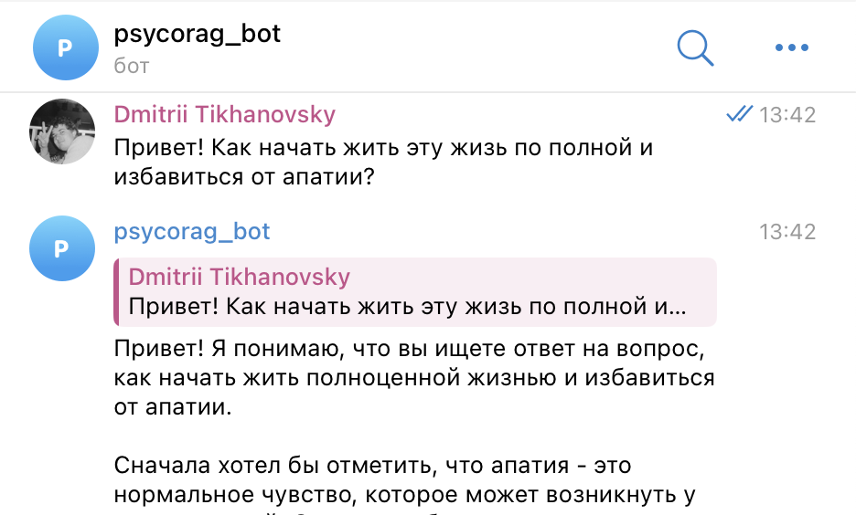

# phycho_rag

### Состав команды (допишите ребята)

- Тихановский Дмитрий Александрович
- Шишаев Вячеслав Алексеевич
- Горохова Александра ...

### Инструкция по запуску

1. Бот доступен в Telegram: [@PsycoragBot](https://t.me/PsycoragBot)

2. Как использовать бот:
   - Отправьте команду `/start` чтобы начать сессию
   - Введите ваш вопрос или опишите ситуацию
   - Бот ответит, используя базу знаний по психологии
   - Используйте команду `/end` чтобы завершить сессию и получить краткий отчет

3. Технические требования (для локального запуска):
   - Python 3.8+
   - SQLite
   - Необходимые библиотеки: aiogram, sqlite3
   - Векторные базы данных:
     - [База книг](https://disk.yandex.com/d/cqIw5ENtAdniKw)
     - [База транскрипций видео](https://disk.yandex.com/d/Ij52Hp8en0AhoA)
     - [База статей](https://disk.yandex.com/d/NXxbq-d3aq_GHQ)

### Описание проекта

Проект представляет из себя RAG-систему, выполняющую роль ассистента по вопросам, связанным с психологическим здоровьем.
Пользователь может получить первоначальную консультацию по личным проблемам, узнать причины их появления и возможные способы их решения. Использование системы осуществляется с помощью телеграм-бота.

### Данные

- Транскрибированные с помощью Whisper ~50 youtube-видео психолога Alok Kanojia, aka HealthyGamerGG, хронометражом от 20 минут до полутора часов;
- Скачанный раздел психологических книг с портала флибуста (3000 книжек), приведенных к формату .pdf;
- Cпаршенный журнал zigmund.online со статьями по психологии и краткими советами по борьбе с психологическими проблемами;
- Собранные вручную 25 вопросов и релевантных ответов на психологические вопросы с r/askpsychology для валидации системы.

### Метрики

Для подсчета метрик использовалась небольшая библиотека groqeval, которая для валидации ответов использует LLama-70b по API ключу от сервиса Groq.
Метрики считаются следующим образом: некоторый ответ/контекст модели делится на отдельные чанки, далее LLM-модель оценивает (от 0 до 10) релевантность/достоверность каждого чанка по отношению к вопросу, итоговая метрика является средним скором всех чанков.
Было посчитано три метрики: 

| Metric    | Faithfulness | Answer Relevance | Context Relevance |
| --------- | ------------ | ---------------- | ----------------- |
| Avg.Score | 7.53         | 6.17             | 6.29              |
